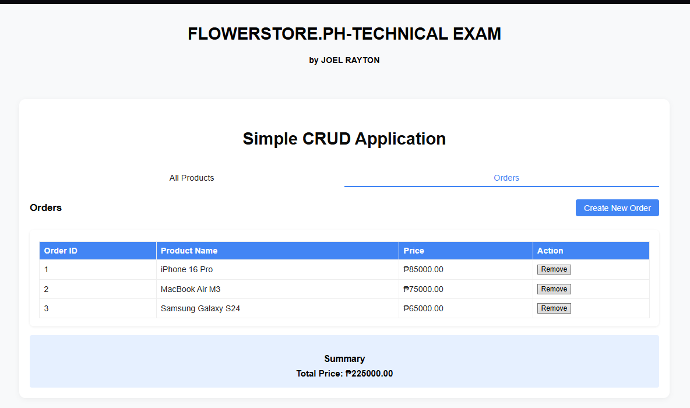
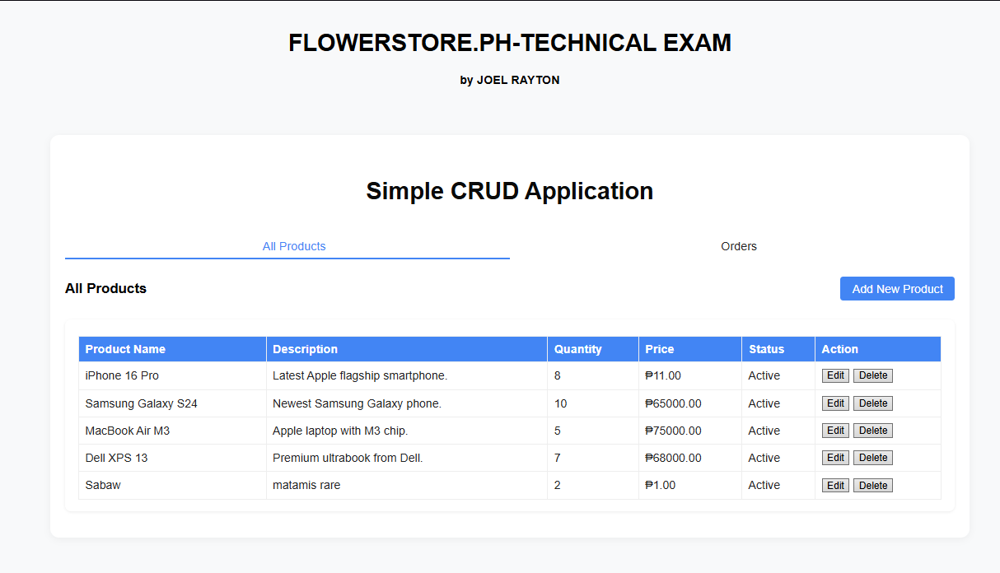

# FLOWERSTORE.PH Technical Exam

A simple CRUD web application built with **Laravel** and **Vue.js** for the FlowerStorePH technical exam.  
Developed by **Joel Rayton**.

---

## Table of Contents

- [Project Overview](#project-overview)
- [Features](#features)
- [Tech Stack](#tech-stack)
- [Setup & Installation](#setup--installation)
- [Usage Guide](#usage-guide)
- [Database Structure](#database-structure)
- [Screenshots](#screenshots)
- [Author](#author)

---

## Project Overview

This project demonstrates basic CRUD operations for products and orders, using dummy data.  
It is designed for technical evaluation and does **not** process real transactions.

The UI is split into two main tabs:
- **Products:** Manage product inventory (add, edit, delete, enable/disable).
- **Orders:** Create and delete orders, view order summary.

---

## Features

- **Product Management**
  - List all products with name, description, price, quantity, and status
  - Add new products
  - Edit product details
  - Delete products
  - Enable/disable products (active/inactive)

- **Order Management**
  - List all orders with Order ID, Product Name, and Price
  - Create new orders (one product per order)
  - Delete orders
  - Summary of total order price at the bottom

- **User Management**
  - Dummy users are seeded for order assignment

- **UI/UX**
  - Responsive, clean interface
  - Tabs for easy navigation
  - Modal forms for product and order creation/editing

---

## Tech Stack & Versions

- **Backend:** Laravel 12.21.0 (API)
- **Frontend:** Vue.js 3.5.18 (SPA)
- **Vue Router:** 4.5.1
- **Build Tool:** Vite 5.2.4
- **Database:** MySQL
- **Styling:** Custom CSS

---

## Setup & Installation

1. **Clone the repository**
   ```bash
   git clone https://github.com/SenpaiJoeru05/FlowerStorePH-tech-exam.git
   cd FlowerStorePH-tech-exam
   ```

2. **Install backend dependencies**
   ```bash
   composer install
   ```

3. **Install frontend dependencies**
   ```bash
   npm install
   ```

4. **Configure environment**
   - Copy `.env.example` to `.env`
   - Set your database credentials in `.env`

5. **Run migrations and seeders**
   ```bash
   php artisan migrate --seed
   ```

6. **Build frontend assets**
   ```bash
   npm run dev
   ```

7. **Start the Laravel development server**
   ```bash
   php artisan serve
   ```
   - Visit [http://localhost:8000](http://localhost:8000) in your browser.

---

## Usage Guide

- **Products Tab**
  - View all products
  - Add new products via the "Add New Product" button
  - Edit or delete products using the action buttons
  - Enable/disable products using the status dropdown in the edit modal

- **Orders Tab**
  - View all orders
  - Create new orders via the "Create New Order" button
    - Only active products with available quantity can be ordered
    - Only one product per order (no quantity selection)
  - Delete orders using the "Remove" button
  - View total price summary at the bottom

---

## Database Structure

**users_table**
| Field         | Type      | Description                |
|---------------|-----------|----------------------------|
| id            | int       | Primary key                |
| first_name    | string    | User's first name          |
| last_name     | string    | User's last name           |
| email_address | string    | User's email               |
| mobile_number | string    | User's mobile number       |
| address       | string    | User's address             |
| status        | enum    | active/inactive/banned/pending          |
| created_at    | datetime  | Creation timestamp         |
| updated_at    | datetime  | Update timestamp           |

**product_table**
| Field              | Type      | Description                |
|--------------------|-----------|----------------------------|
| id                 | int       | Primary key                |
| product_name       | string    | Name of the product        |
| product_description| string    | Description                |
| quantity           | int       | Stock quantity             |
| price              | decimal   | Product price              |
| status             | enum    | enabled/disabled           |
| created_at         | datetime  | Creation timestamp         |
| updated_at         | datetime  | Update timestamp           |

**order_table**
| Field       | Type      | Description                |
|-------------|-----------|----------------------------|
| id          | int       | Primary key                |
| product_id  | int       | Foreign key to product     |
| user_id     | int       | Foreign key to user        |
| price       | decimal   | Order price                |
| created_at  | datetime  | Creation timestamp         |
| updated_at  | datetime  | Update timestamp           |

---

## Screenshots




---

## Author

**Joel Rayton**  
Pasay, Philippines

---

## Notes

- This project is for technical demonstration only.
- No real payment or transaction is processed.
- Dummy data is used for users, products, and orders.

---

**Thank you for reviewing my technical exam project!**
